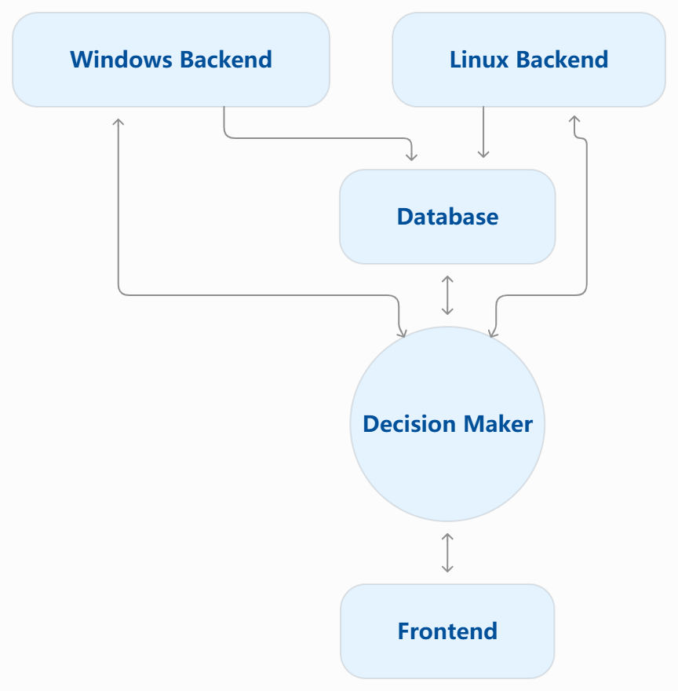

# Wise Storage Director (WSD) — Team 21

## Product Details
 
#### Q1: What is the product?

**Wise Storage Director (WSD) is a cross-platform storage management and optimization application that helps users make better use of mixed-speed storage devices by observing storage workloads, identifying performance bottlenecks, and recommending or applying workload-aware storage policies.**

*Figure 1. High-level concept of WSD: the system observes workloads across mixed-speed storage devices and provides workload-aware recommendations and optimization options.*

Nowadays, many people cannot afford a PC built entirely with fast storage, while others continue using older computers to weather the hardware price hikes driven by growing AI demand. As a result, many systems contain storage devices with very different performance characteristics as a compromise between cost, capacity, and performance. Users often need to decide manually which storage device should hold their files or applications in order to improve performance or make effective use of limited storage capacity, which can be unnecessarily complex for non-technical users. And over time, the importance of the same software for users is constantly changing. However, users often have to endure the decisions made during the initial installation (unless uninstalling or reinstalling, which may result in data loss).

WSD aims to make existing storage hardware more effective by monitoring storage activity and presenting information such as throughput, I/O activity, latency, and frequently accessed files or processes. Based on this information, it can help place performance-sensitive data on faster storage and reduce unnecessary pressure on slower devices. A longer-term goal is to reduce avoidable writes where possible to help extend device lifespan.

The product will be a local storage-management application with an interactive dashboard. The local application monitors and manages storage activity, while the dashboard provides a unified view of storage devices, workloads, performance, and optimization options. It will support both simplified recommendations for general users and more detailed controls for advanced users.

For example, **a user with a small SSD and a large HDD may not have enough SSD capacity for all applications.** WSD can identify frequently accessed or performance-sensitive data that would benefit most from the SSD while leaving colder data on the HDD. 

Similarly, on **systems with several drives of different speeds**, WSD can help users decide where data should be placed based on actual workload behaviour rather than manual guesswork.

WSD is a student-proposed CSC301 project and does not have an external partner organization.

#### Q2: Who are your target users?

* College students/recent graduates who own older computers, specifically those that are over 5 years old, that can do a quick search and learn/have a basic understanding of storage (e.g. HDD, SSD, etc.)
* College students/recent graduates that cannot afford expensive storage upgrades, but want to make their computer storage faster
* Recent graduates or users who work within the IT industry and/or have a strong technical background, enjoy disk management, and want to make their computer storage faster without buying any storage upgrades, such as new hardware

#### Q3: Why would your users choose your product? What are they using today to solve their problem/need?

Our product is mainly targeting the users having multiple storage devices with different performance characteristics, especially SSD + HDD systems. 
We aim to accelerate the speed, optimize storage and help extend device lifespan on systems that struggle with storage performance. 
The users will be given advice of data placement, caching recommendations and workload prioritization, help them place frequently accessed data on higher-speed storage devices and reduce unnecessary I/O operations.

Currently, users may rely on many storage management tools: Windows task manager and Resource Monitor are used to monitor disk usage and I/O activity of individual processes; 
WizTree helps users view disk space usage; Storage Spaces allows users to consolidate and manage multiple storage drives. However, 
WSD aims to give an accessible alternative to the existing storage-management tools, and we will provide a simple and understandable graphical interface for the users,
allowing less technical users to view storage performance and understand optimization recommendations without advanced technical expertise.

WSD not only displays metrics such as IOPS, throughput, and workload information but also translates them into easy-to-understand optimization recommendations, 
sparing users the trouble of interpreting raw performance data themselves.
This helps users to understand which processes are affecting the performance, as they can choose whether to optimize their storage and select different optimization modes.
By default, WSD only provides optimization recommendations. Users can either apply these recommendations manually or explicitly enable automatic execution for selected optimization strategies. 

#### Q4: What are the user stories that make up the Minimum Viable Product (MVP)?

* As a storage enthusiast, I want to open the GUI in order to monitor the real-time I/O status of each running application.

* As a storage enthusiast, I want to open the GUI and navigate to an individual application in order to monitor its historical I/O usage.

* As a college student with an old computer with slow storage, I want to enable RAID 0 mode in order to maximize storage capacity and move I/O-intensive files to the fastest disk.

* As a college student with an old computer with slow storage, I want to enable caching mode in order to retain data integrity and copy I/O-intensive files to the caching disk.

* As a college student with an old computer with slow storage, I want to open the GUI in order to get recommendations on which files should be moved/cached on the fastest disk.

* As a college student with an old computer with slow storage, I want to enable auto mode in order to automatically have frequently accessed files cached/moved to the fastest storage device on my computer.

* As a college student with an old computer with slow storage, I want to open the GUI in order to see an approximation of how much time was saved by this app.

#### Q5: Have you decided on how you will build it? Share what you know now or tell us the options you are considering.

WSD will use a cross-platform architecture consisting of platform-specific Windows and Linux backend agents, an analysis and policy component, a database, and a web-based dashboard. The Windows and Linux agents will collect storage and workload information from the host system, the analysis component will convert these observations into recommendations or optimization decisions, and the dashboard will present device status, workload behaviour, recommendations, and before-and-after performance results to the user.

  

#### Technology stack

- **Windows Backend Agent:** We are currently considering Python for the initial prototype. The Windows agent will collect storage and workload information using Windows-provided interfaces such as Performance Counters and other OS APIs. For storage-management functionality, we are still evaluating open-source and user-space-friendly options on Windows. Unlike Linux, some similar Windows tools are proprietary or license-restricted, so we are currently investigating approaches such as WinFsp and other lightweight implementations that could support functionality similar to the Linux backend without relying on closed-source commercial tools.

- **Linux Backend Agent:** We are currently considering Python for the initial prototype. The Linux agent will use standard Linux monitoring interfaces and tools such as `iostat`. We are also considering tools such as mergerFS for storage-placement or pooling experiments where appropriate. For caching or tiering experiments, we are currently evaluating FUSE-based user-space approaches, with compatibility, performance overhead, and implementation complexity still under investigation.

- **Analysis and policy layer:** This component will process metrics such as throughput, IOPS, latency, read/write behaviour, queue pressure, and hot + cold data information to produce explainable recommendations. The exact policy implementation will evolve as we benchmark different workloads.

- **Database:** A relational database will be used to store device information, workload measurements, historical observations, and recommendations. The specific database technology is still being evaluated.

- **Frontend:** The dashboard will be implemented as a web application. The exact frontend framework is still being evaluated by the frontend team.

#### Architecture and deployment

The initial system will primarily run locally on the user's machine rather than requiring a kernel driver. We plan to rely on existing operating-system APIs and user-space tools wherever possible.

The high-level data flow is:

`Storage Devices → OS → Windows/Linux Backend Agent → Metrics Database → Analysis & Policy Engine → Web Dashboard → Recommendation → User-approved Action`

Where an optimization can safely be automated, WSD may allow the user to enable automatic execution. Otherwise, the system can operate in a recommendation-only mode so that the user remains in control of storage changes.

For development and testing, individual components may run as separate local services. We will decide later whether any shared backend or cloud deployment is useful; it is not required for the initial MVP.

#### Third-party tools and APIs

At this stage, we expect to rely primarily on operating-system interfaces and established open-source tools rather than external commercial APIs. Candidate dependencies include system-monitoring utilities and storage-management tools such as mergerFS on Linux. Additional libraries and frameworks will be selected as the implementation is refined.

----
## Intellectual Property Confidentiality Agreement

WSD is a student-proposed project and does not have an external partner organization. The team currently intends to keep the project open source.

As of now we have agreed to keep the project open source.

----

## Teamwork Details

#### Q6: Have you met with your team?

Do a team-building activity in-person or online. This can be playing an online game, meeting for bubble tea, lunch, or any other activity you all enjoy.
* Get to know each other on a more personal level.
* Provide a few sentences on what you did and share a picture or other evidence of your team building activity.
* Share at least three fun facts from members of you team (total not 3 for each member).

#### Q7: What are the roles & responsibilities on the team?

Describe the different roles on the team and the responsibilities associated with each role (e.g., frontend, database). 
 * Roles should reflect the structure of your team and be appropriate for your project. One person may have multiple roles.  
 * Add role(s) to your Team-[Team_Number]-[Team_Name].csv file on the main folder.
 * At least one person must be identified as the dedicated partner liaison. They need to have great organization and communication skills.
 * Everyone must contribute to code. Students who don't contribute to code enough will receive a lower mark at the end of the term.

List each team member and:
 * A description of their role(s) and responsibilities including the components they'll work on and non-software related work
 * Why did you choose them to take that role? Specify if they are interested in learning that part, experienced in it, or any other reasons. Do no make things up. This part is not graded but may be reviewed later.

#### Q8: How will you work as a team?

We plan to have weekly meetings. As of now we plan on holding them on Tuesdays at 7PM/19:00. We plan to book meeting rooms in Robarts library.

The purpose of each meeting is to report on progress and discuss areas where difficulties have been encountered, assign tasks, discuss important design choices, and report on what tools or libraries we find that we may want to use.

We will track what is discussed in each meeting by writing the meeting's minutes and/or recording it.
  
#### Q9: How will you organize your team?

* We organize our team using Discord for communication and GitHub (Issues, PRs, and repository access, to which our TA will be granted access) for technical tracking, supported by weekly in-person meetings where we document formal meeting minutes, address blockers, and make architectural decisions. 
* We prioritize tasks by identifying which items are critical path dependencies for upcoming project deliverables, assigning them initially based on individual strengths and component ownership (e.g., databases vs. I/O algorithms) while actively encouraging cross-functional pairing so teammates gain exposure to new areas. 
* To track work from inception to completion, tasks progress from being planned and assigned during our weekly meetings, to active development communicated via Discord check-ins, to code review via GitHub Pull Requests, and finally to completion once merged. Completion is verified through peer code reviews and relevant testing before changes are integrated into the main branch.

#### Q10: What are the rules regarding how your team works?

**Communications:**

For general inquiries, the project's discord server has scope specific channels where team members can ask questions. 
We also work with github pull requests (PR) that must be reviewed to be merged into main. If a PR doesn't fit the expectations or implementation details expected of it, we can discuss it directly on github to then correct it.
We expect to communicate progress at least twice a week: once during the meeting and at least once when pushing code or requesting a PR.

**Collaboration:**

People are expected to attend meetings unless communicated 12 hours in advance as to give enough time to discuss delaying the meeting. If a team member does not attend the meeting, they are expected to communicate their progress in the appropriate channels and respond to questions in a timely manner as to mitigate the loss of progress incurred from them missing the meeting. If a team member repeatedly misses meetings and/or clearly does not collaborate sufficiently after repeated attempts at fixing the issue, the TA will be contacted.

## Organisation Details

#### Q11. How does your team fit within the overall team organisation of the partner?
**N/A — WSD is a student-proposed project and does not have an external partner organization.**

Therefore, Team 21 acts as the main product development team. We are responsible for the frontend, Windows backend, Linux backend, database, algorithm design, system integration, and testing and validation.

#### Q12. How does your project fit within the overall product from the partner?
**N/A — WSD is a student-proposed project and is not part of a larger partner product.**

The current CSC301 project is the first MVP and working prototype of WSD. Our goal is to implement and validate the full workflow from backend data collection and database storage, through analysis and decision making, to frontend presentation and optimization recommendations. At this stage, success means producing a working, demonstrable, and testable prototype.

## Potential Risks

#### Q13. What are some potential risks to your project?

* Uncertain about which method to use for the Linux backend to achieve "caching mode."  
  Because MergerFS doesn't work well with duplicate files, either symbolic links or FUSE will be used. Symbolic links have the advantage of being easy to manage, but have the disadvantage of compatibility issues with certain software, such as anti-cheat-enabled games, while FUSE is much more complicated and requires further investigation.

* Due to the technical nature of this project, some group members will have difficulty understanding the project.  
  Because this project heavily involves OS and hardware interfaces, some less tech-savvy group members will need to spend more time learning the terminology and relevant information to understand the conversations.

* Compatibility across different OSes (especially Linux).  
  Because this project will support both Windows and Linux, and Linux has many distributions, compatibility across all platforms will be an issue.

* Designing an algorithm that's one size fit all may be overcomplicated.
  Algorithm thresholds may not suitable across different devices and workloads. Fixed proxies could have different meaning which may lead to unnecessary data movement or ineffective recommendations

* Integration friction due to individually developed component of the project. 
 Developing the storage interceptor, database, and policy engine independently risks integration friction or delays if data formats and API contracts are not kept tightly aligned.
#### Q14. What are some potential mitigation strategies for the risks you identified?

* Uncertainty Around the Linux Caching Approach: We will build quick, isolated prototypes to benchmark and evaluate multiple Linux caching approaches (such as symbolic links versus FUSE) in terms of performance overhead, maintenance complexity, and software compatibility before committing to a final backend design. This will establish a uniform caching approach with the least problems going forward, so it is important that we test it early.
* Steep Technical Learning Curve: We will use our weekly in-person meetings for architectural walk-throughs and knowledge sharing, pair experienced members with those newer to systems programming, and encourage teammates to promptly flag blockers or technical questions on Discord so issues are resolved as soon as they arise.
* Cross-Platform Compatibility (Windows and Multiple Linux Distributions): We will decouple our core management and policy logic from OS-specific hooks through abstraction layers, and focus on stabilizing a single baseline target environment before expanding to additional platforms.
* Algorithm Threshold & Workload Generalization Risk: Rather than assuming a single static configuration works across all hardware, we will benchmark our heuristics across diverse hardware setups and synthetic workloads, thus tuning our scoring metrics and policy thresholds rather than just assuming.
* Component Integration Friction: We will define and freeze our data formats and API contracts early through shared interface specifications before implementing components. We will also provide mock endpoints so the people working on the backend agent, database, and policy engine can test and develop without blocking each other.
